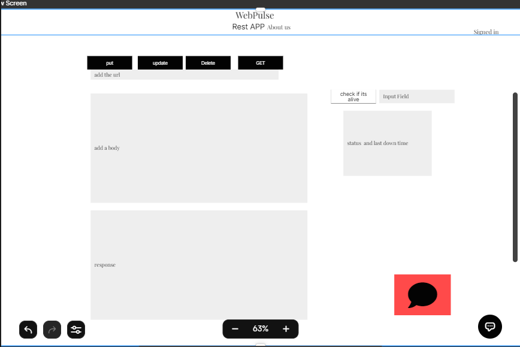

### What is the vision of this product?
A product that provides a full solutions for your development needs

### What pain point does this project solve?
having multiple applications in 1 place that makes it faster to use instead of having a single app for each .

### Why should we care about your product?
This product came up with the idea based on fast and effecient work that can be done in 1 place .

### Scope
**In**
the user can test REST requests in our product
the user can test if a certain website or a server is down
the user can get some help by our customer service
**Out**
this product will not be a mobile app
this product will not take all the feautres from postman
this product will not have a very complex UI
Minimum Viable Product
to be able to do the required functions regarding of the looks .

**Stretch goal**
to make it a google Chrome Extension .

**Functional Requirements**
user can send a get , add , put and delete Requests
user can enter a website url and it will check if its down and when it was last down
the admin can accept chat requests from registered regarding the customer service
the user can sign up
**Non-Functional Requirements**
unit testing to make sure the app does what its required to do
security our app does not require a very scure registration all we need is authentication
organised code files to not have a messy code messy code = bad code

## User stories 

1. as a User i want to be able to test the REST functions and see them in action realtime .
2. as a User i want i want to be able to check if a certain website or server is down or not . 
3. as an authorized User i want to be able to connect with the customer service team in case i run into some issues . 
4. as a User i want a simple but effecient Ui . 
5. as a User i want a safe and reliable experience . 

## Wireframe : 

